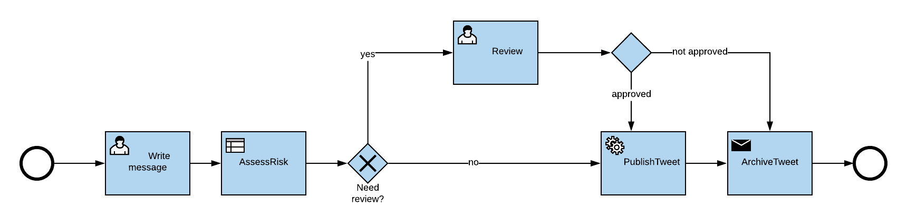

# Using azure durable functions apis and message hub - Getting started


## Demo

[Click here to visit live demo](https://tweetcheckerfrontend.azurewebsites.net/)

## Overview 

This sample uses an simple [react single page application](https://reactjs.org/) to interact with a workflow implemented as [azure durable function](https://docs.microsoft.com/en-us/azure/azure-functions/durable/durable-functions-overview) and the built in [durable api](https://docs.microsoft.com/en-us/azure/azure-functions/durable/durable-functions-http-api). 


## How To Run This Sample

To run this sample, you'll need:

- [Visual Studio 2017 with Azure development tools installed ](https://docs.microsoft.com/en-us/azure/azure-functions/functions-develop-vs)
- An Internet connection
- Azure subscription
- [Node / npm >=6.4.1](https://www.npmjs.com/get-npm)
- [Ftp client e.g WinSCP](https://winscp.net/eng/download.php)

### Step 1:  Clone or download this repository

From your shell or command line:

`git clone https://github.com/CommunicateNorge/AppAndIntFagkveld1302.git`
> Given that the name of the sample is pretty long, and so are the name of the referenced NuGet pacakges, you might want to clone it in a folder close to the root of your hard drive, to avoid file size limitations on Windows.

### Step 2:  Create a azure function app from the azure portal

Go to portal.azure.com and click "create a resource" -> "function app"


     
 ### Step 3: Deploy workflow from visual studio 
 
 Open /startingpoint/workflow/TweetCheckerWorkflow/TweetCheckerWorkflow.sln in VS. 
 
 Right click project "TweetCheckerWorkflow" and chose "publish" do your newly created function app. 
 
 
 ### Step 4: Create web app service from the azure portal
 
 Go to portal.azure.com and click "create a resource" -> "Web App".
 
 
 

 ### Step 5: Build front end
 
 [Details](https://medium.com/@to_pe/deploying-create-react-app-on-microsoft-azure-c0f6686a4321)
 
 Navigate to 
 
 `cd /startingpoint/frontend/`
 
 Open 
 
  `cd ../src/App.js`

```JavaScript
const REACT_APP_API_URL="<insert function app host  e.g https://myfunctionap.azurewebsites.net/>";
const FUNCTION_APP_KEY = "<insert function app key"
```

Add function app URL and function key from step 3
 
 Install dependencies 
 
  `npm install`
  
  Build for deploy
  
  `npm run-script build`
 
  ### Step 6: Deploy frontend
  
  Go to Deployment Center-> ftp (take note of endpoint and password) from step 4.
  
  Upload all content from \build to site\wwwroot
  
  ### Step 7: Allow front end through cors filter 
  
  Open cors-filter on function app from step 2 and add url for front end web app
  
  
# Extending the sample 

The /startingpoint needs some work. The follwing section describes how to play around to get a working example running. 

You should create branch for your group. This makes it a easier to collaborate.  

From your shell or command line:

`git clone https://github.com/CommunicateNorge/AppAndIntFagkveld1302.git
git checkout -b mygroupbranch
git push origin mygroupbranch`

## Create message hub integration 
For archiving all messages we need to integrate with a legacy filing system that only proccess flat files in a archean file format from file share. 
We will use "Message hub" allow us to set up this  integration. 

### Create "mapper" (optional)

Create a [dll-map](https://communicateno.atlassian.net/wiki/spaces/CMH/pages/150044794/On+Off-Boarding#On/Off-Boarding-Boarding-OutboundConfiguration(Mandatory)) or use provided xxx.dll to convert from json to flat file. 

When completed use the [upload function] ( https://portal-dev-app.azurewebsites.net/codemappings) to make it available for your integration configuration

### Create "out bound"-Configuration 

You will create a "out bound"-configuration that will transform messages posted into message hub from the workflow and place them on a ftp-server.
From the [dev-environment](https://portal-dev-app.azurewebsites.net/configurations) select "Add configuration".

ReceiverID : filingsystem{your group number} 
SenderId : tweetchecker{your group number} 
DocumentType : Tweet{your group number}


#### Adapter Type
sftp 
Connection Url : 77.88.107.42
Username : Fagsamling 
Password : <Credentials will be provided during the presentation>
Sftp Directory : your group (e.g group2)

### Mappnig

Message Transformation Outbound Sas Uri : Use the mapper you created in "Create  mapper" or use TweetMapper(provided)

### Test the "out bound"-Configuration 

Post a message to 

`https://cmh-dev-transactionhandler-fa.azurewebsites.net/api/TransactionHandler?code=GxCLHO55vkN7NI/tCa1vlj3RiYbLAcxE89ZdygjlRBtsksRmRnFN2A==&SenderId=tweetchecker{your group number} &ReceiverID=filingsystem{your group number}&DocumentType=Tweet{your group number}&MessageFormat=json&MessageEncoding=utf-8`

With body 

```JavaScript
{
   "created" : "2019-02-12",
   "from" : "me",
   "text" : "text",
   "status" 1,
   "approvedBy" : "him"
}
```

Veify that the message gets mapped and placed in correct folder on the ftp-server.      

## Complete the azure workflow 

We want to create workflow that allows end users to post messages that will end up as tweets.
However: sometimes there can be useful with an extra set of eyes before tweets hit the internet.



Start of using /startingpoint/workflow/TweetCheckerWorkflow/TweetCheckerWorkflow.sln in VS.

You will notice functions with activity triggers that match the workflow above. 

You need to extend each task. 

### Trigger workflow 

You need to make the http-post start an durable orchestration.
[See documentaion](https://docs.microsoft.com/en-us/azure/azure-functions/durable/durable-functions-concepts#c)

```cSharp
        [FunctionName("function_HttpStart")]
        public static async Task<HttpResponseMessage> HttpStart(
            [HttpTrigger(AuthorizationLevel.Anonymous, "get", "post")]HttpRequestMessage req,
            ILogger log)
        {
            // Function input comes from the request content.

            var message =  JsonConvert.DeserializeObject<Message>(await req.Content.ReadAsStringAsync());

            /*   Start new workflow called "Workflow" 
             *   return starter.CreateCheckStatusResponse(req, instanceId);
             */

            return new HttpResponseMessage();
        }
```

### AssessRisk
Make "AssessRisk" an [activity function](https://docs.microsoft.com/en-us/azure/azure-functions/durable/durable-functions-types-features-overview#activity-functions). 
Bonus : Use your imagination on how to asses the potential risk of a message hiting the internet.  

### Review
The human task of checking the message makes this workflow a long running workflow (ideal for durable functions). 
You set change the code so that execution halts until an external event called "ManualReviewCompleted" is raised. 

```cSharp
      if(message.RiskLevel>6)
            {
                context.SetCustomStatus("WaitingForManualReviewCompleted");
                /*
                 * Wait for external event :  "ManualReviewCompleted"
                 */
                context.SetCustomStatus("ManualReviewCompleted");
            }
```

   
### PublishTweet
Make "PublishTweet" an [activity function](https://docs.microsoft.com/en-us/azure/azure-functions/durable/durable-functions-types-features-overview#activity-functions). 
Further you will need to integrate with twitter and post the approved message. Keys and credentials will be provided. 

### ArchiveTweet
Make "ArchiveTweet" an [activity function](https://docs.microsoft.com/en-us/azure/azure-functions/durable/durable-functions-types-features-overview#activity-functions). 
Further you need to integrate with the message hub "outbound"-config creaated earlier. Keys and credentials will be provided.

## Extend front end 

### Add support for "rewinding" instances 

The "rewinding"-button does nothing in the current UI. Use the [api reference](https://docs.microsoft.com/en-us/azure/azure-functions/durable/durable-functions-http-api) to figure out how to fix that. 

### Create a more dynamic UI 

The current UI does not poll the function api for new instance status ( you need to refresh the site in order to get updates). 
Figure out how to make the app more dynamic. 


  
